# Pipeline de Depuración — FermentAI

```mermaid
flowchart TD
    START(["`**ENTRADA**
    ZIP recibido
    aporte_id`"])

    ZIP_OK{¿ZIP válido?}
    ERR_ZIP[/ERROR: archivo no es un ZIP válido/]

    subgraph P1["PASO 1 — Validación Estructural"]
        P1A{¿Una sola carpeta\nFERM01–FERM12?}
        P1B{¿Existe subcarpeta\nimagenes/?}
        P1C{¿Existe\nFERM##_metadata.csv?}
        P1D([ferm_code extraído])
    end

    ERR_P1A[/ERROR: sin carpeta FERM / múltiples FERM/]
    ERR_P1B[/ERROR: subcarpeta imagenes vacía/]
    ERR_P1C[/ERROR: CSV requerido no encontrado/]

    subgraph P0["PASO 0 — Validación CSV"]
        P0A{¿UTF-8 válido?}
        P0B{¿Columnas exactas?\n14 cols, ni de más\nni de menos}
        P0C{¿1 ≤ filas ≤ 500?}
        P0D["Por cada fila:
        • ferm_fecha_hora: formato YYYYMMDD_HHMMSS, no nulo
        • ferm_fecha_hora: estrictamente posterior a fila anterior
        • glucosa…acido_formico: float ≥ 0, sin nulos
        • validado_asesor: TRUE o FALSE, sin nulos"]
        P0E([Genera no_conformidades_iso\ncsv_valido = True/False])
    end

    ERR_P0A[/ERROR: CSV no está en UTF-8/]
    ERR_P0B[/ERROR: Columnas faltantes o no reconocidas/]
    ERR_P0C[/ERROR: CSV vacío o supera 500 filas/]

    COLLECT["Recopilar entradas en imagenes/
    ─ JPEG (.jpg/.jpeg) → procesar
    ─ Otras extensiones → ADVERTENCIA y omitir"]

    subgraph P2["PASO 2 — Cabecera JPEG (magic bytes)"]
        P2A["Por cada JPEG:
        ¿primeros 3 bytes == FF D8 FF?"]
        P2B{¿>50% inválidas?}
        P2C{¿Quedan 0\nimágenes?}
        P2D([Lista válida p2])
    end

    DISC2(["DESCARTADA
    motivo: cabecera JPEG inválida
    paso: 2"])
    ERR_P2A[/ERROR: >50% con cabecera inválida/]
    ERR_P2B[/ERROR: 0 imágenes tras paso 2/]

    subgraph P3["PASO 3 — Resolución mínima"]
        P3A["Por cada imagen válida p2:
        Decodificar PIL → RGB"]
        P3B{¿w ≥ 1280\ny h ≥ 720?}
        P3C{¿Quedan 0\nimágenes?}
        P3D([Lista válida p3])
    end

    DISC3A(["DESCARTADA
    motivo: imagen no legible
    paso: 3"])
    DISC3B(["DESCARTADA
    motivo: resolución insuficiente
    paso: 3"])
    ERR_P3[/ERROR: 0 imágenes tras paso 3/]

    subgraph P45["PASOS 4 y 5 — Procesamiento por imagen"]
        direction TB
        P4["PASO 4 — Resize / Crop
        ① Si ya es 1280×720 → sin cambios
        ② Si misma relación → resize LANCZOS
        ③ Si distinta relación → cover-fit + recorte central
        Resultado: imagen exactamente 1280×720"]
        P5["PASO 5 — CLAHE (mejora de contraste)
        RGB → LAB
        Aplicar CLAHE (clipLimit=2, tile 8×8) sobre canal L
        LAB → RGB → JPEG q95
        Resultado: bytes procesados"]
    end

    MINIO["Subida a MinIO
    raw/{aporte_id}/{filename}      ← bytes originales
    processed/{aporte_id}/{filename} ← bytes CLAHE"]

    MINIO_ERR{¿Error en\nsubida?}
    ROLLBACK["ROLLBACK
    Eliminar todos los objetos
    ya subidos (raw + processed)"]
    ERR_MINIO[/ERROR: fallo al subir a MinIO/]

    REPORT(["REPORTE FINAL
    ─ fermentacion_id
    ─ total_recibidas
    ─ total_procesadas
    ─ total_descartadas
    ─ csv_valido + no_conformidades_iso
    ─ imagenes_descartadas (nombre, motivo, paso)
    ─ rutas_raw[]
    ─ rutas_processed[]
    ─ advertencias[]"])

    %% Flujo principal
    START --> ZIP_OK
    ZIP_OK -->|No| ERR_ZIP
    ZIP_OK -->|Sí| P1A

    P1A -->|No| ERR_P1A
    P1A -->|Sí| P1B
    P1B -->|No| ERR_P1B
    P1B -->|Sí| P1C
    P1C -->|No| ERR_P1C
    P1C -->|Sí| P1D

    P1D --> P0A
    P0A -->|No| ERR_P0A
    P0A -->|Sí| P0B
    P0B -->|No| ERR_P0B
    P0B -->|Sí| P0C
    P0C -->|No| ERR_P0C
    P0C -->|Sí| P0D
    P0D --> P0E

    P0E --> COLLECT
    COLLECT --> P2A

    P2A -->|No| DISC2
    P2A -->|Sí| P2D
    DISC2 -.->|registrada en reporte| P2B
    P2D --> P2B
    P2B -->|Sí| ERR_P2A
    P2B -->|No| P2C
    P2C -->|Sí| ERR_P2B
    P2C -->|No| P3A

    P3A -->|Error lectura| DISC3A
    P3A -->|OK| P3B
    P3B -->|No| DISC3B
    P3B -->|Sí| P3D
    DISC3A -.->|registrada en reporte| P3C
    DISC3B -.->|registrada en reporte| P3C
    P3D --> P3C
    P3C -->|Sí| ERR_P3
    P3C -->|No| P4

    P4 --> P5
    P5 --> MINIO
    MINIO --> MINIO_ERR
    MINIO_ERR -->|Sí| ROLLBACK
    ROLLBACK --> ERR_MINIO
    MINIO_ERR -->|No| REPORT

    %% Estilos
    classDef error fill:#fee2e2,stroke:#ef4444,color:#7f1d1d
    classDef descartada fill:#fef9c3,stroke:#ca8a04,color:#713f12
    classDef ok fill:#dcfce7,stroke:#16a34a,color:#14532d
    classDef step fill:#ede9fe,stroke:#7c3aed,color:#2e1065
    classDef io fill:#dbeafe,stroke:#2563eb,color:#1e3a8a

    class ERR_ZIP,ERR_P1A,ERR_P1B,ERR_P1C,ERR_P0A,ERR_P0B,ERR_P0C,ERR_P2A,ERR_P2B,ERR_P3,ERR_MINIO error
    class DISC2,DISC3A,DISC3B descartada
    class REPORT ok
    class P1A,P1B,P1C,P0A,P0B,P0C,P0D,P2A,P2B,P2C,P3A,P3B,P3C,P4,P5 step
    class START,P1D,P0E,P2D,P3D,COLLECT io
```

## Resumen de los pasos

| Paso | Nombre | ¿Qué hace? | ¿Qué descarta/falla? |
|------|--------|-----------|----------------------|
| **Paso 1** | Validación estructural | Verifica que el ZIP tenga exactamente una carpeta `FERM01–FERM12`, subcarpeta `imagenes/` y el CSV. | `PipelineError` si falta alguno |
| **Paso 0** | Validación CSV | Verifica columnas exactas, filas entre 1–500, `ferm_fecha_hora` con formato y orden cronológico, numéricos ≥ 0, `validado_asesor` TRUE/FALSE | `PipelineError` si columnas mal; no-conformidades ISO si datos inválidos |
| **Paso 2** | Magic bytes JPEG | Comprueba que los primeros 3 bytes sean `FF D8 FF` (firma real de JPEG) | Descarta imagen; error si >50% inválidas o quedan 0 |
| **Paso 3** | Resolución mínima | Comprueba que `w ≥ 1280` y `h ≥ 720` | Descarta imagen; error si quedan 0 |
| **Paso 4** | Resize / Crop | Escala y recorta al centro para obtener exactamente **1280×720** | — |
| **Paso 5** | CLAHE | Mejora el contraste en espacio LAB antes de guardar como JPEG q95 | — |
| **MinIO** | Almacenamiento | Sube original (`raw/`) y procesada (`processed/`) para cada imagen | Rollback completo si falla cualquier subida |
